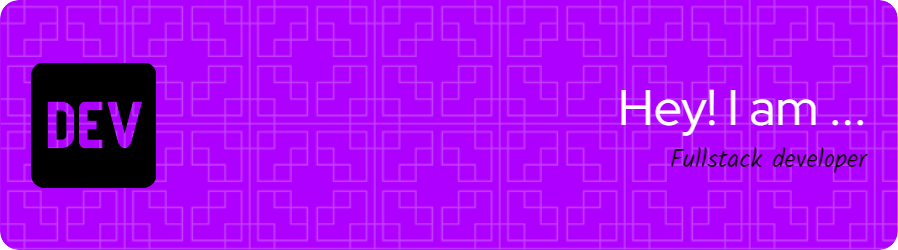

### Hi there 👋, my name is Abbas
####  I'm on a growth journey to solidify my skills as a Full Stack Web Developer.

I'm a passionate Full Stack Web Developer. I blend creativity with technical skills to craft user-friendly digital solutions. Let's connect and create something awesome together!

Feel free to reach out!

Skills: React / NestJS / TailwindCSS / Laravel

- 🔭 I’m currently working on **KLUBJAM**
- 🌱 I’m currently learning **NextJS**
- 👯 I’m looking to collaborate on **Open projects**
- 📫 How to reach me **kanjkannj@gmail.com**

        

  

